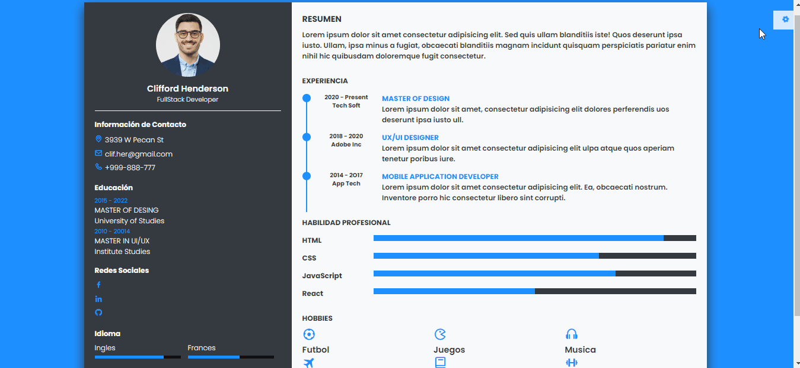
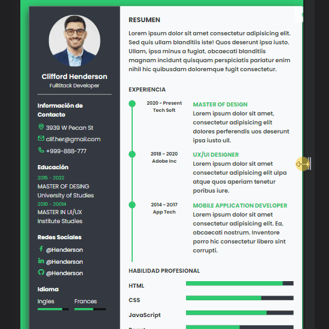

# _Trabajo Final Modulo 3_
## *Resumen CV Responsivo*
## Caracteristica del Proyecto
- Usa tipografía de Google Fonts
- Usa Boxicons para los iconos
- Usa Eventos Js para seleccionar color, mostrar url y un scroll


## Desarrollador
[<br><sub>Emanuel Alejandro Ibañes</sub>](https://github.com/alecio87)


## Tecnología
Es código abierto, el mismo se encuentra en un ```repositorio público``` en GitHub

- [HTML](#technologies)
- [CSS](##technologies)
- [JS](##technologies)

## Vista Previa
***Preview #1***



***Preview #2***

